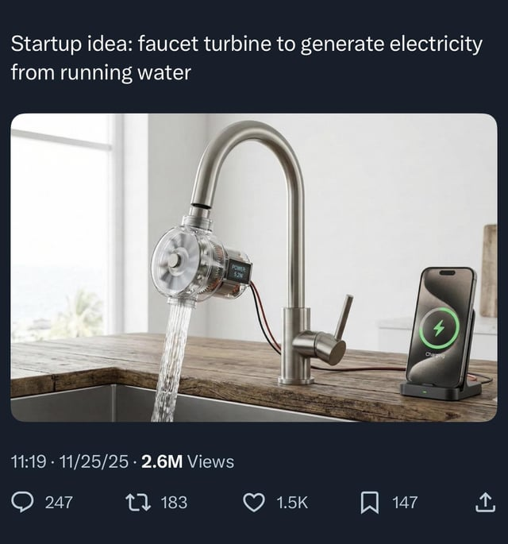

(To be digested)
The ability to create singular written works is mostly impervious to education and technical supplementation; it is overwhelmingly what we used to call gifted or God-given and today call either genetic or inspired. (View Highlight)
Note: Perhaps this is true. Equally, perhaps it's the very fact that *not enough people* have access to and understanding of a system like the zettelkasten that results in so few works of significance being created. With the rise of AI and technologies like ChatGPT will we suddenly see a massive increase in the number of published authors? I suspect not. And to me that would constitute a data point  indicating that something other than the difficulty of writing (or having genetic brilliance) is playing a major role in who produces written works. It could perhaps more easily be explained by factors such as a huge % of the world's population not being educated to a high-enough degree or to social structures that lead to writing not being seen as an option by many. Equally factors like poverty may play a role. It's an oversimplification on the author's part to say that there are only a limited number of authors because writing is an act of brute force and willpower.

True and I would agree that marketing claims can be misleading. At the same time, effective marketing makes a very specific claim to a very specific audience and in most cases, if the product/software/course doesn't deliver on its promise, you're able to get your money back, in which case railing against "greedy people charging for knowledge" doesn't really hold up to scrutiny. Especially not when you're someone who's likely paid tens or even hundreds of thousands of dollars on tertiary education, which is the original "knowledge behind a paywall" business model and it would be a fool's errand to argue that university course descriptions are exercises in clarity in terms of detailing the product being sold, who it'll help and how it'll do so.
Sr: https://lite.evernote.com/note/d69cf793-1f14-48f4-bd48-43f41bd88678

---

Power was not loyalty. Magic was not worship. Faith could be wielded like any other blade, or abandoned when its edge dulled.

---

It would work, it would just make the water come out of your faucet a bit slower and wouldn't generate much power.

Typical flow rate for a kitchen faucet is 2.2 gallons per minute say. That's 139 grams of water per second.

And let's overestimate the velocity and say it's 3 m/s (6.7 mph). Then the kinetic energy of 139 g of water at that speed is 0.63 J, so the max power generated would be 0.63 W (and it would be less because we're overestimating and a turbine can't capture all the energy).

A 5 V USB charger drawing 1 A, which is what those really slow basic phone chargers with none of the faster charging capabilities draw, is already using 5 W. So you couldn't even charge a phone on this if you had the water running constantly.

Maybe you could charge your phone while you run your bath. But what's the point of that?

Edit: If you hooked it up to a battery it might actually not be completely useless. It would charge very slowly and you'd have a power bank when you need it. Still probably not worth the inconvenience and cost of the device.

Edit 2: Actually even with a battery it's pretty useless. You have to remember it's only producing any power when the tap is running. And that power is really low. See this comment and this comment. You would not have a power bank when you need it, you could leave it there for months and it still wouldn't be charged when you need it.

Edit 3: Actually there's a pretty significant thing I missed here. I calculated the power based on kinetic energy of the water we see coming out of the faucet, which is what you would get with the kind of water wheel design you see in the image, I think.

However, if we calculate the power using pressure * flow rate, we find that the 2.2 gallons per minute with a pressure of 60 PSI gives a theoretical maximum power collection of 57.4 Watts. This is shockingly more. I guess this represents hooking up a turbine directly to the tap, before any contact with air, and driving the turbine using the water pressure.

Doing this would of course lower the water pressure coming out of the tap significantly, though you could only partially lower it and still collect a decent amount of energy. You could indeed charge your phone while the tap is running. Though that's still not really practical. You could also use it to charge a power bank. Of course you could also just use your wall outlet. The electricity here is worth like 70 cents per year if you run the tap 15 minutes a day. The device would still take decades to pay for itself.

From what I understand the discrepancy here can be accounted for mostly with turbulent kinetic energy. Most kitchen faucets have an aerator attached which will mix air into the water, and this converts a lot of the kinetic energy that was directed out of the tap into turbulent kinetic energy which can no longer be collected with a turbine. It's surprising how much of the energy gets converted though. I'm not super qualified here, I might still be missing something. Maybe someone who knows more than me can help verify this is right.

---

Although while Irwyn was preparing to delve in, Elizabeth instead chose to go explore the ‘feast hall’. Irwyn was not hungry as the Trial still repressed all their physical needs and told her as much. To which she just shrugged, decided it was fine to ‘indulge gluttony’ and left, promising to be back soon with snacks.

---
I have not been dominated by the Dominant Idea of my Age; I have chosen mine own allegiance, and served it. I have proved by a lifetime that there is that in man which saves him from the absolute tyranny of Circumstance, which in the end conquers and remolds Circumstance,—the immortal fire of Individual Will, which is the salvation of the Future.”

---

1 find common ground
2 show interest
3 seize weakness

---
Keep it private till its permanent

---

---

I am, the seeker.
Grasp it al
Know it all
Grow

---
Can you dream of eternity?
Can you imagine it?
Is imagination (eventually) limitless, if it is, then we should be able to right?

---
Hate till it all burns, crawl into yourself, collapse, rage, hate and pain.
An emptiness, a touch lost.
What is left
Chains and hesitation
