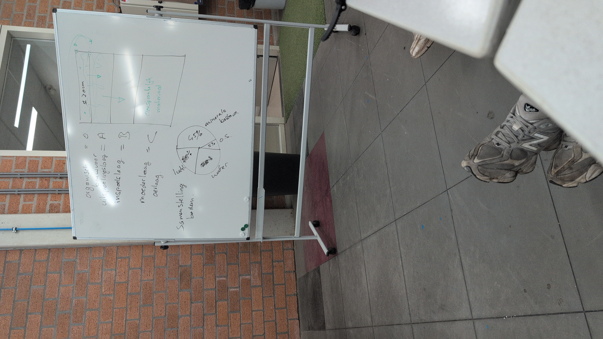
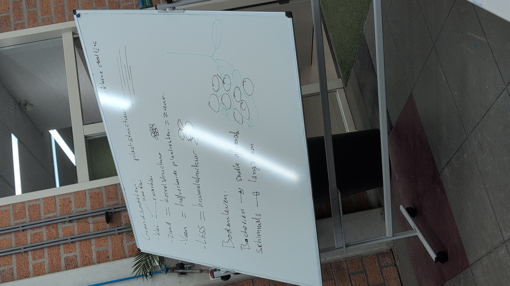
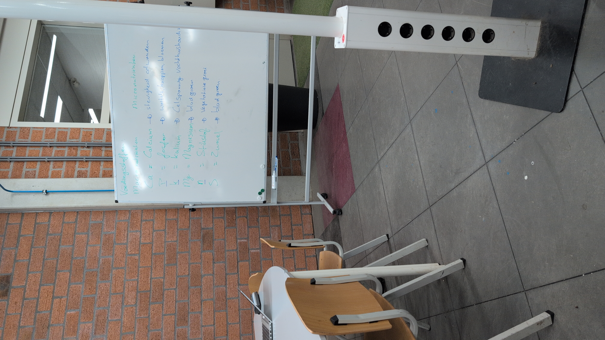
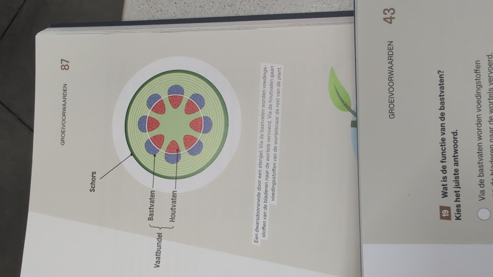

# periode 1

# School learning

# roel bouwman

- 06-41777024

- POC (moet teruggestuurd worden naar adminisrtatue yuverta)

- praktijk of bedrijf, kennistoets op school

- meld aan bedrijf welke focus je hebt van period

- vca VOL aanvragen

- - -

# leerdoelen

1. klantvriendelijkheid/sociaal zijn.
2. onkruidverdelger
3. aanleg softscape(plant)
4. bemesting
5. aanleg hardscape
6. meer bouw leren(tuinen kan ik well maar nog niet veel ervaring bouw)

---

study go downloaden

---

wormpoep
kalk
koeienmest

​# 4 manieren beheersing

- chemisch
- thermisch(heet water, branden)
- mechinaal
- mechenisch/handmatig
- insecten tegen specifieke soort

specifiek certificaat voor chemisch.(afgeraden, voor gezondheid mens en tuin)

schrepel

---
wat kan hovenier zijn?
iemand die tuinaanleg doet voor een klant, dit kan bijvoorbeeld:
electricitijd(belichting)
loodgieter(kraan)
onderhoud.
metselen
bestraten
dakpan

---
# Periode 2:

## week 1
Opbouw bodem

Hoe Bodemverbetering:
- Compost
- Schimmel
- insecten
- Bacterie

# week 2

**Bodemvormem** **factoren**
- topografish(ligging)
- temperatuur

**Groeifactoren**
- licht (zon)
- water(transport voeding)
- voedingstoffen(groei en ontwikkeling)
- temperatuur(boven 10 celcius, groei)
- koolstof (groei en fotosynthese)
- zuurgraad(bij juiste PH is voeding opname mogelijk)

Kraanwater is niet beste voor plant, vang zelf water op.

Kringlopen
- voeding(dier naar organische stof )
- koolstof(fotosynthese) {co2 = koolstof + water + licht -> glucose + waterstof}
- stikstof (bacterien)

Iperen.com/kennis-nieuws

Processen in de plant
- fotosynthese
- transport(houtvaten,  bostvaten)

Voedingstoffen in de bodem
- bodemvocht
- kleideeltjes(-> kleihumus complex -> opneembaar vermogen voeding(maakt voeding vrij))
- verwening(minerale deeltjes)
- wortels

# week 3

Mest
- organisch 
- anorganisch
- bodem verbeteraars
     -  soorten
     - koemest
     - eiwitten van insecten
     - kunstmest
     - 
    -  merk: bayer

Bodem vs mest
- mest; voeding, NPK, 
- bodemverbeteraar; compost, verbetert structuur

Wortelgoed; kaal wortel (goedkoopst)
Kluit; gaas, met grond er nog aan (2 duurste)
Container; in een pot (duurste)

Plantgat; 1/3 groter dan kluit/wortels, onder de grond maken. Plant vanaf de kwekerijdiepte/kleurlijn.
Bovenste laag apart.
Vierkant gat is bijna altijd beter.
Zet boompaal schuin
Boompaal 1/3 de grond in

Dungking.eu

# week 4

- cunet = ruimte voor al het straatwerk

Pad 1 meter breed; cunet 1.1 meter

Formaat knlinkers
- Waal (5; 20; 6-8)
- dik (7; 20; 6-8)
- kei (10; 20; 6-10)

10-20-10 = bkk (beton knlinker)

