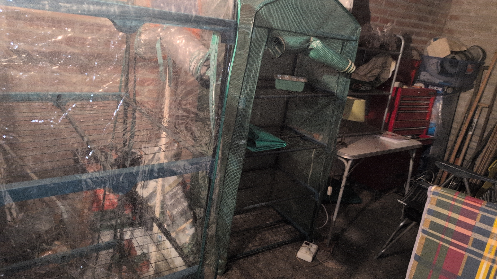
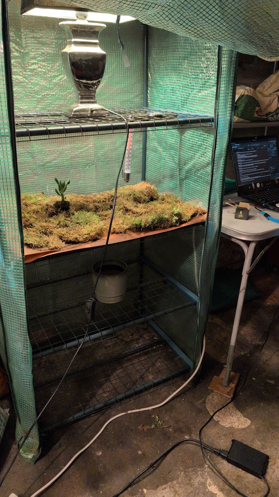
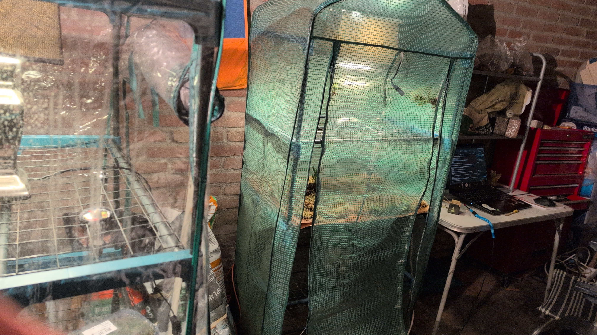

# Shed Greenhouse Project

## references

- [🌱plant_terrarium_project](<./🌱plant_terrarium_project.md>)
- [🌱how_to_grow_moss](<./🌱how_to_grow_moss.md>)

---

## setup context

currently have a shed, where im going to be growing plants.

what i'm going to be making/growing:
- terrariums(priority1)
- moss(priority1)
- succulents(priority2)
- mushrooms(priority3)

currently have 2 rudimentary greenhouses

I live in a [zone 8A](https://www.plantmaps.com/interactive-netherlands-plant-hardiness-zone-map-celsius.php), Netherlands

---

## current tasks

- [ ] heating pad/heat pipes

- [ ] misting system
  - [x] placed a water bucket under it ✅ 2026-03-19

- [ ] fan
	- [ ] buy
	- [ ] install

- [ ] control system for automatic adjustment
	- [ ] research

- [ ] hygrometer
	- [x] rudimentary hygrometer ✅ 2026-03-19
		- [x] buy ✅ 2026-03-19
		- [x] install ✅ 2026-03-19
	- [ ] electric hygrometer

- [ ] thermometer
	- [ ] electric thermometer
	- [x] rudimentary thermometer ✅ 2026-03-19
		- [x] buy ✅ 2026-03-17
		- [x] install ✅ 2026-03-19

- [x] grow lamps or LED lamps ✅ 2026-04-22 [i bought these](https://www.123led.nl/Sylvania-LED-Batten-60-cm-incl-lamp-4000K-920-lumen-8W-i18838.html)
  - [x] weak lamps(insufficient) ✅ 2026-03-19

- [x] timer for switching off electricity ✅ 2026-04-10

---

## progress

# 1

finnaly got the led lights i wanted, (need to paste link here)

# 1

had a very nice talk with a coworker of mine that is and was(?) really into growing specific rare plants, and such he knows how to build a terrarium, i was apparently researching in the wrong way with the thing im building now, i was researching greenhouses and reverse engineering then when i should have looked at the paledarium side of thiings, knowing how to build and and knowing what techniques go in there

# 1

finnaly bought timed switches that turn on at 08:00 and turn off at 20:00.
the lamps are still to weak so i need to buy better ones

### 2026-04-15

finally cleaned up the shed, i can now use it for projects, i have decided on building 2 climate-greenhouses(buying one is like 1000 euro, i aint got that money)
i brainstormed a general plan.
i need to buy some things

---

### 2026-04-16

tried to find the stuff i need to buy at boerenbond uden, they didn't have shit, except a shitty hygrometer and basic thermometer.
bought 2 hygrometers and 2 thermometers.
tomorrow im going to Intratuin.

---

### 2026-04-17

went to Intratuin Veghel, they also didn't have jack shit.
they didn't have lamps for plants, no grow lights, no heat lamps, no redlight, no LED lights.
then i went to find any heating-related stuff, which they didn't have jack shit off, how do you not have a basic heat pad to grow seedlings???
also didn't have any cocos ground, even the expanding ones.
only thing i bought there was some moss, which i put in my greenhouse to test.

bro i went to the Action to buy some lamps and some cocos ground, shits ridiculous.

---

## cool research i did because im amazing

### main stuff

- temperature, light, humidity, and airflow

#### problems

- it's way too cold in this shed
  - electrische verwarming? but not precise enough
  - maybe heat 'lamp'?
  - heat pads?

- i don't have enough light
  - cheap/efficient way: LED lights
  - grow light maybe?

- air quality? do i have to keep the door open? not enough wind in the shed
  - electric fan? high electricity cost
  - microfan?

- insulation
  - could i cover the greenhouses in plastic sheets?

### secondary stuff

- measuring of data (temperature, air quality)
- energy problems (things have to be on for the whole day)
  - get most efficient solution reasonably priced
- night vs day automation
  - timed automatic off switch for electricity
  - possible sequence: on > redlight > grow lights > off > repeat
  - humidity controller
  - thermostat controller
	> basic strategy:  
	> timer > grow lights  
	> thermostat > heater  
	> humidity controller > humidifier

- humidity, plants don't grow in same levels
  - plastic sheet coverage
  - limited presence (spray water manually every other week)
  - basic watering system or misting system

- substrate/ground/earth
  - buy basic substrate and mix correct amounts

- pest control/management
  - neem oil (preventative)
  - potential problems:
	- fungus gnats
	- mold
	- mites
	- imbalance of springtails