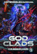
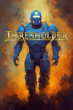
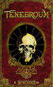
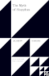
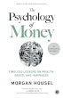
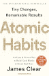
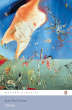

# Some of my favorite fiction books are:

**[godclads](https://www.royalroad.com/fiction/59663/godclads)** by OstensibleMammal.

**[Thresholder](https://www.royalroad.com/fiction/60396/thresholder)** by Alexander Wales.

**[Tenebroum](https://www.royalroad.com/fiction/58643/tenebroum-book-1-stubbed)** by DWinchester.

**[REND](https://www.royalroad.com/fiction/32615/rend)** by Temple.

**[Ghost in the City](https://www.royalroad.com/fiction/62125/ghost-in-the-city-cyberpunk-gamer-si)** by Seras.

## Some of my favorite non-fiction books are:

**[The Myth of Sisyphus](https://www.goodreads.com/book/show/91950.The_Myth_of_Sisyphus)** by Albert Camus.

**[The Psychology of Money](https://www.goodreads.com/book/show/41881472-the-psychology-of-money)** by Morgan Housel.

**[Atomic Habits](https://www.goodreads.com/book/show/40121378-atomic-habits)** by James Clear.

**[Nausea](https://www.goodreads.com/book/show/298275.Nausea)** by Jean-Paul Sartre.

